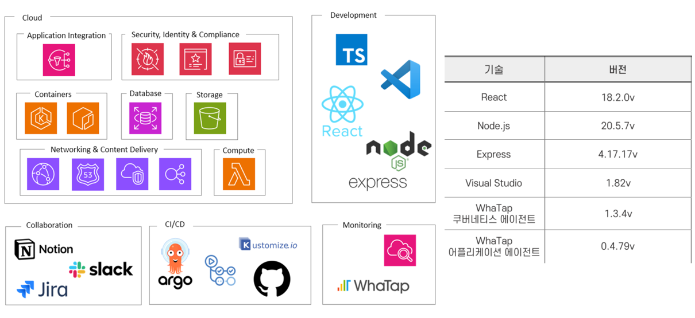
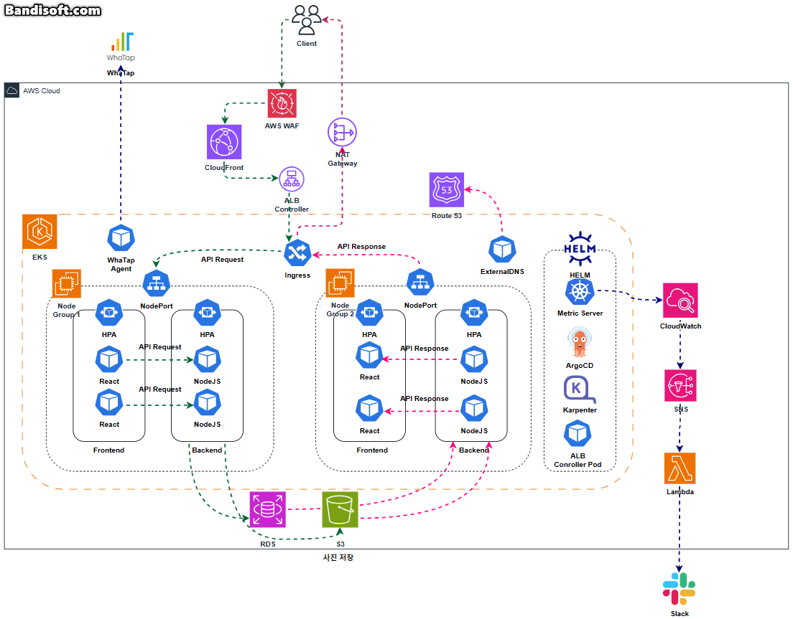
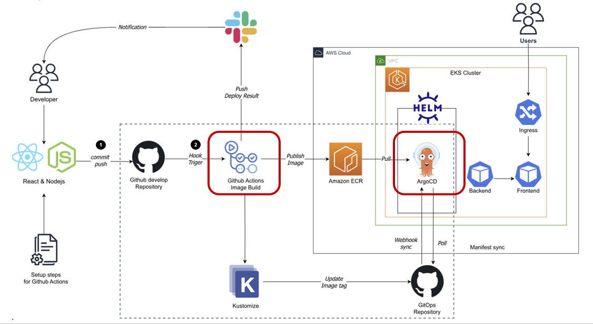
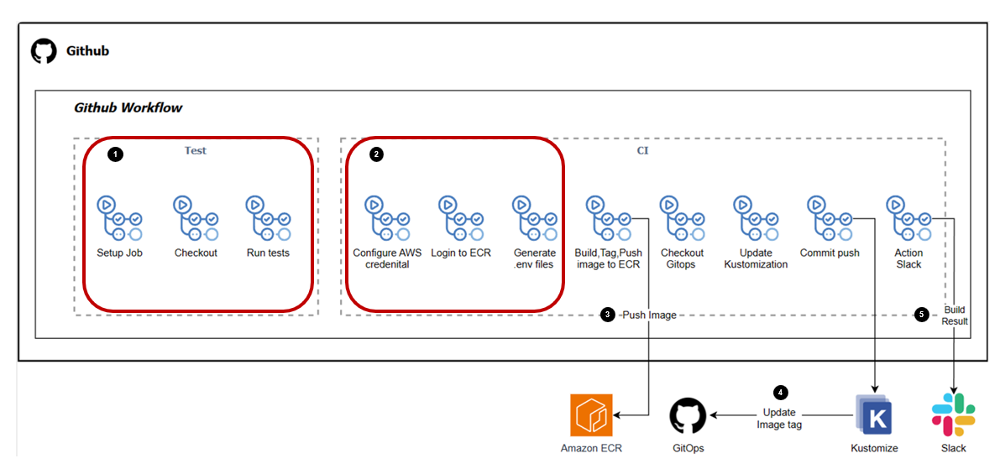
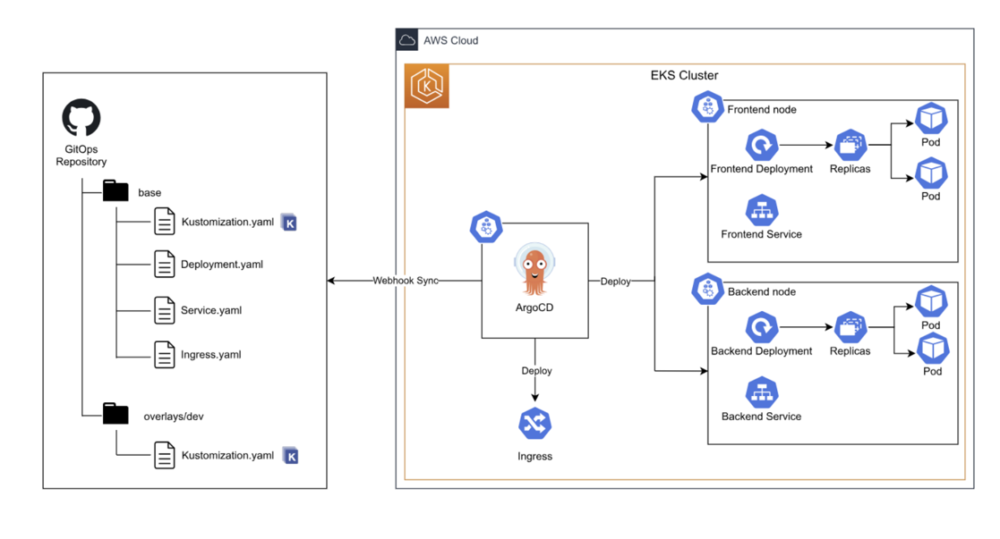

# 이미지 메타데이터를 활용한 클라우드 기반 다이어리 서비스 LogLand
 
### 기간  
 2023.8.28.~2023.9.20.  
 
### 내용   
NodeJS와 React 기반 사진 다이어리 웹 사이트 AWS의 리소스들을 사용해 서비스 및 Terraform으로 프로비저닝
 
### 상세 과정
 
1. Node JS 및 React 어플리케이션 개발
   a. 타임라인 및 로그인, 구글 맵 기능 구현  
   b. 사용자 데이터 -> RDS, 사진 업로드 데이터 -> S3     
2. Terraform으로 리소스 프로비저닝(EKS, VPC, CloudFront, CloudWatch, RDS...)
3. CloudFront 활용 S3 및 ALB 캐싱
4. EKS 활용 어플리케이션 컨테이너화
5. CloudWatch, WhaTap으로 모니터링
6. Github Actions와 ArgoCD 활용 CI/CD
7. WAF 활용 Application 보안

### 사용 기술 stack
 
 

### System Architecture  

**EKS**

  

**CI/CD**

  

**CI WorkFlow**
    

**CD WorkFlow**
  

### 인원 및 역할
- 총원 5명 
- 역할 : EKS, Terraform, WhaTap

### 상세 역할

**< part (1) : EKS 활용 LogLand 서비스 >**  
   - EKS Deployment Test Manifest 작성 및 Application 연동
   - Helm 활용 EKS 클러스터 외부 ADD-ON(ALB-Controller, ExternalDNS, Metric-Server, ArgoCD) 설치 
**< part (2) : Terraform으로 리소스 프로비저닝 >**
   - VPC, Cloudfront, 
   - module활용 EKS 및 외부 ADD-ON 설치  

**< part (3) : WhaTap 모니터링 >**
   - WhaTap 에이전트 활용 EKS 리소스 모니터링
   - NodeJS 어플리케이션 모니터링
   - 
# 프로젝트 결과

## AI-Speaker & NewsSum 시연 영상 (썸네일 Click!)

### 개선 사항 
- Stress Test 시 단순 HTTP 접속 테스트밖에 하지 못했음
- Kakao Login 밖에 구현하지 못한점(Cognito를 사용하지 않은 점)
- 다양한 Trouble Shooting을 경험해보지 못한 점
- 로깅 및 모니터링에 대한 이해 부족으로 해당 부분을 깊이있게 하지는 못함
- ElastiCache를 Terraform으로 프로비저닝까지 했으나 시간 부족으로 연동하지 못했음
- Jira를 깊게 활용하지 못하고 Confluence도 써보지 못함(Notion으로 대체)
