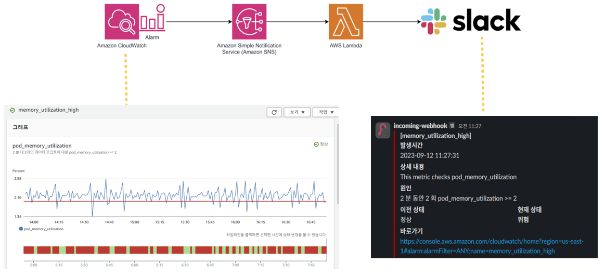
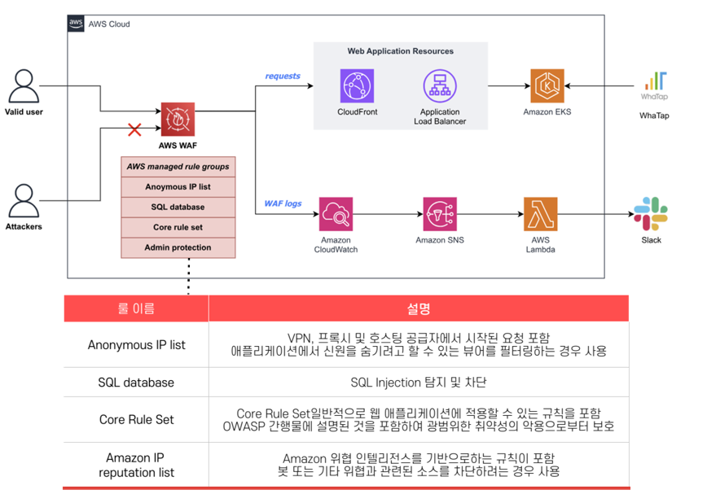

# 이미지 메타데이터를 활용한 클라우드 기반 다이어리 서비스 LogLand
 
### 기간  
 2023.8.28.~2023.9.20.  
 
### 내용   
NodeJS와 React 기반 사진 다이어리 웹 사이트 AWS의 리소스들을 사용해 서비스 및 Terraform으로 프로비저닝
 
### 상세 과정
 
1. Node JS 및 React 어플리케이션 개발
   a. 타임라인 및 로그인, 구글 맵 기능 구현
   b. 사용자 데이터 -> RDS, 사진 업로드 데이터 -> S3     
3. Terraform으로 리소스 프로비저닝(EKS, VPC, CloudFront, CloudWatch, RDS...)
4. CloudFront 활용 S3 및 ALB 캐싱
5. EKS 활용 어플리케이션 컨테이너화
6. CloudWatch, WhaTap으로 모니터링
7. Github Actions와 ArgoCD 활용 CI/CD
8. WAF 활용 Application 보안

### 사용 기술 stack
 
 

### System Architecture  

**EKS**

  

1. 사용자가 www.log-land로 접속(Route53)
2. WAF의 정책으로 공격자만 걸러짐
3. CloudFlont로 캐싱 및 외부 도메인을 통해 ALB로 연결
4. ALB는 EKS ADD-ON(ALB-Controller)을 통해 EKS의 Ingress에 연결
5. EKS Node Group의 NodePort를 통해 내부 POD 통신
6. EKS Metric-Server를 통해 CloudWatch -> SNS -> Lambda -> Slack으로 내부 리소스 모니터링
7. WhaTap Agent를 EKS 내부에 설치 -> WhaTap으로 리소스 모니터링

**CI/CD**

  

**CI WorkFlow**
    

**CD WorkFlow**
  

**Moitoring**
  

**Security**
  

### 인원 및 역할
- 총원 5명 
- 역할 : EKS, Terraform, WhaTap

### 상세 역할

**< part (1) : EKS 활용 LogLand 서비스 >**  
   - EKS Deployment Test Manifest 작성
   - Ingress 활용 Routing Rule 생성 및 외부 서비스
   - Helm 활용 EKS 클러스터 외부 ADD-ON(ALB-Controller, ExternalDNS, Metric-Server, ArgoCD, Karpenter or Cluster AutoScaling) 연동 

**< part (2) : Terraform으로 리소스 프로비저닝 >**
   - resource 활용 VPC, CloudFront, CloudWatch, SNS, S3, RDS, Security Group, Bastion Host   
   - module 활용 EKS 및 외부 ADD-ON 설치  

**< part (3) : WhaTap 모니터링 >**
   - WhaTap 에이전트 활용 EKS 리소스 모니터링
   - NodeJS 어플리케이션 모니터링
     
# 프로젝트 결과

## AI-Speaker & NewsSum 시연 영상 (썸네일 Click!)

### 개선 사항 
- Stress Test 시 단순 HTTP 접속 테스트밖에 하지 못했음
- Kakao Login 밖에 구현하지 못한점(Cognito를 사용하지 않은 점)
- 다양한 Trouble Shooting을 경험해보지 못한 점
- 로깅 및 모니터링에 대한 이해 부족으로 해당 부분을 깊이있게 하지는 못함
- ElastiCache를 Terraform으로 프로비저닝까지 했으나 시간 부족으로 연동하지 못했음
- Jira를 깊게 활용하지 못하고 Confluence도 써보지 못함(Notion으로 대체)
